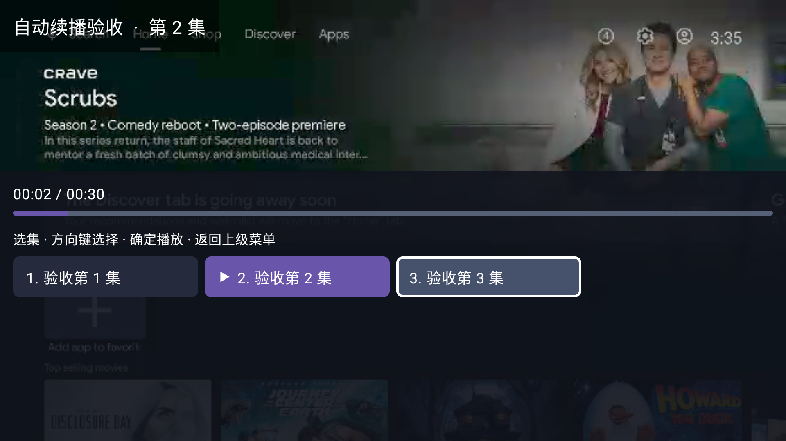

# 自动下一集模拟器实测

日期：2026-10-03（Asia/Singapore）。

结果：12 项场景全部通过；Debug APK 构建成功，Gradle 的 23 个单元测试全部通过。本次测试未发现需要修改功能代码的问题。

## 环境与方法

- Android TV ARM64 模拟器 `emulator-5554`，Android 16 / API 36，Media3 1.6.1。
- 构建命令：`./gradlew :app:assembleDebug :app:testDebugUnitTest`。
- APK：`app/build/outputs/apk/debug/app-debug.apk`。
- APK SHA-256：`2b636867c65c5376f9a27583bf76d6ee96c4816e7ae302165f23da150a8075b1`。
- 在模拟器桌面生成 30 秒 MP4 视频，以同一媒体样本构成三集测试条目，避免真实媒体地址失效干扰续播逻辑。
- 本地临时服务实现兼容内容、选源、解析及播放记录接口；包含两个内容源，并可控制下一集解析失败、解析延迟及换源详情延迟。仅修改临时服务的数据，不修改真实服务端观看记录。
- 通过 ADB 遥控器按键、界面树、截图及测试服务接收到的播放记录交叉验证。导航入口和部分面板入口用模拟器点击，焦点保留和执行操作用方向键及确定键验证。

## 场景结果

| 场景 | 验证结果 |
| --- | --- |
| 小窗顺序续播及末集停止 | 第 1、2 集结束后分别进入第 2、3 集，保持小窗；第 3 集结束停在 30 秒，不循环、不换源。 |
| 全屏选集面板与焦点 | 播放第 1 集时把焦点移到第 3 集，自动进入第 2 集后面板与焦点保留；按确定播放第 3 集。 |
| 全屏菜单与焦点 | 焦点停在下一集操作，自动切集后菜单保持；按确定正确再进入下一集。 |
| 全屏换源面板与焦点 | 焦点停在源 B，自动续播后换源面板保持；按确定正确播放源 B 的当前集。 |
| 快进到片尾 | 通过右键定位至片尾，剩余内容播放结束后进入下一集。 |
| 下一集解析失败及手动恢复 | 下一集解析返回 503，显示测试错误，记录保留第 1 集结束位置；恢复测试接口后手动重选第 2 集可播放。 |
| 后台加载下一集 | 第 1 集结束、下一集解析延迟期间按 Home；等待加载完成再返回，停在 00:00 且记录仍属于第 1 集；手动播放后记录更新为第 2 集。 |
| 手动选择覆盖自动加载 | 下一集解析延迟期间手动选第 3 集；第 3 集播放，等待旧请求原定完成时间后仍保持第 3 集。 |
| 当前集后台暂停 | 播放中按 Home，返回后仍暂停、位置不推进；手动播放后进度继续增加。 |
| 下一集开始后立即退出与续播 | 第 2 集实际开始播放即返回离开详情；记录为第 2 集起点，再进入正确从该集继续。 |
| 返回键逐层关闭 | 返回键依次退出选集面板至菜单、关闭菜单、退出全屏至小窗、离开详情至首页。 |
| 手动选集覆盖换源请求 | 延迟获取源 B 详情期间手动选择源 A 第 3 集；取消换源请求，等待后仍保持源 A 第 3 集，未写入源 B 的播放记录。 |

小窗自然播放测试中，服务依次收到第 1 集结束位置 30 秒、第 2 集起点 0 秒、第 2 集结束位置 30 秒和第 3 集起点 0 秒，符合切集前保存旧进度、实际播放后写新进度的规则。

菜单和换源竞态测试最初各有一次测试脚本操作错误：菜单多按一次右键，换源等待期间错误地假定面板已关闭。检查界面后修正测试步骤，两项复测通过；应用代码未因这两次脚本失败而修改。

## 证据

- [12 项最终结果](results.json)
- [播放、解析及延迟事件](playback-events.json)

自动进入第 2 集后，当前播放标记更新，而选集焦点仍停在第 3 集：

下一集在后台加载完成后，回到前台仍停在 00:00 并显示暂停图标：

## 恢复与范围

原服务配置、加密登录及观看数据已逐字节校验恢复；临时 ADB 端口转发已移除，测试服务器已停止，模拟器内的临时视频和界面树文件已清理，恢复校验后的临时用户配置备份已删除。模拟器保留新版 Debug APK。

本次验证覆盖可控 MP4 样本的播放器事件、界面、遥控器焦点、请求竞态、后台暂停和观看记录。本次视频无音轨，未验证音频静音；未覆盖真实服务端存储行为、真实内容源、HLS/FLV 或 Android 6 真机兼容性。精确在同一瞬间触发 Home 与结束回调、重复结束通知等边界另有状态单元测试支持。
